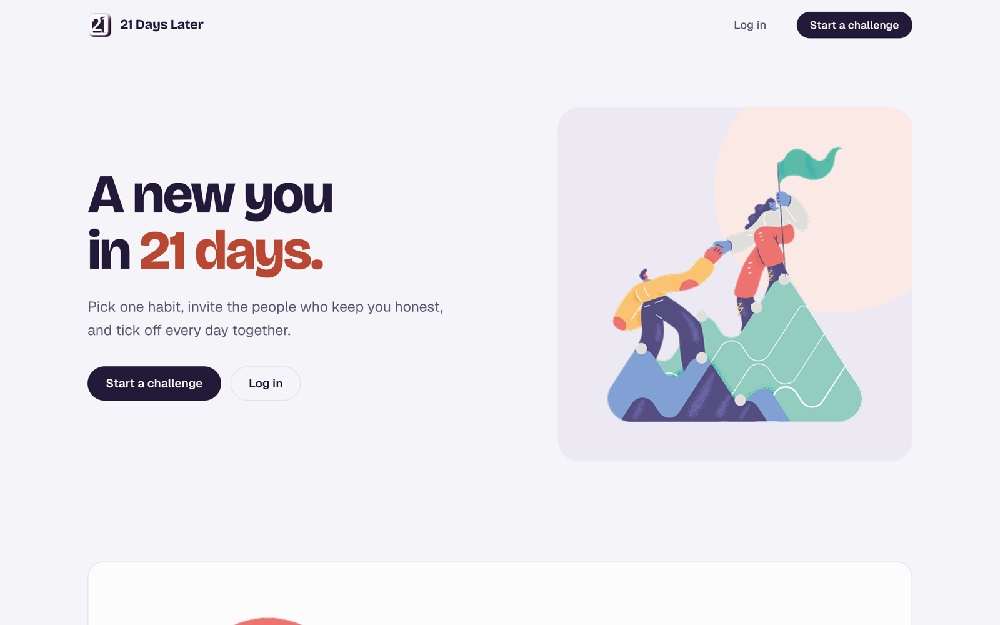
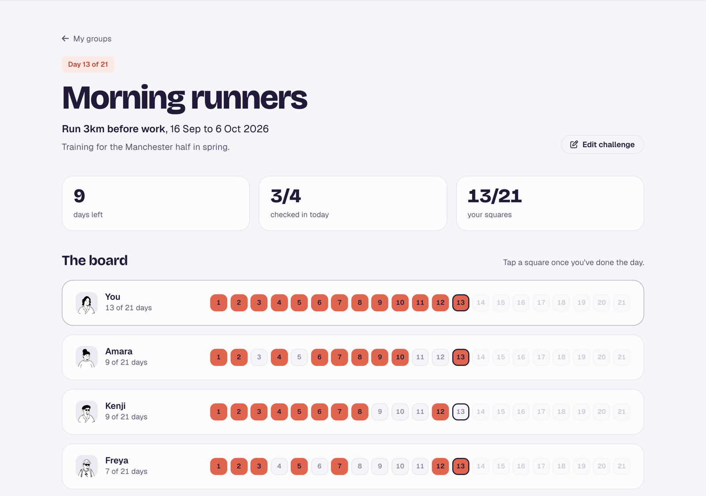
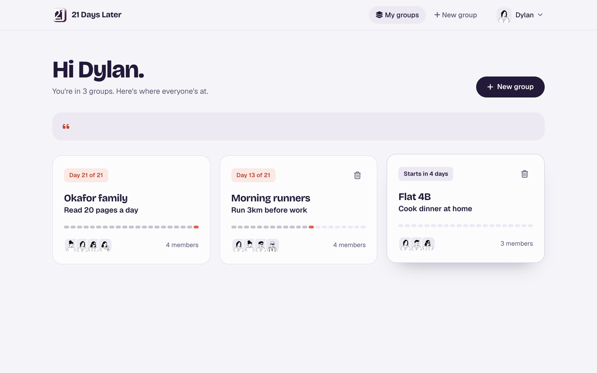
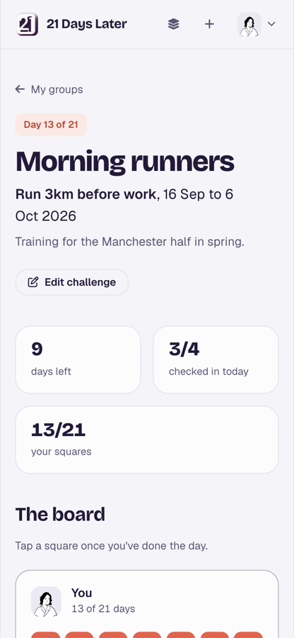

# 21 Days Later

A habit tracker you do with other people. Make a group, pick one habit, and everyone ticks off the same 21 days together.



## What it does

- Create a group and invite friends by username
- Set a challenge: one habit, a reason, and a start date
- Tick off each day on a shared 21-day board, so everyone can see who showed up
- Comment and like to keep the group going
- Finish all 21 days and get a small celebration



| Your groups | On mobile |
|---|---|
|  |  |

## Built with

Ruby on Rails 7, PostgreSQL, Hotwire (Turbo and Stimulus), Devise, Bootstrap and SCSS, Cloudinary for profile photos.

## Run it locally

You need Ruby 3.3.5 and PostgreSQL running.

```bash
git clone https://github.com/itsdakpan/twenty-one-days-later.git
cd twenty-one-days-later
bundle install
bin/rails db:setup
bin/rails server
```

Open http://localhost:3000 and log in with the demo account:

- Email: `demo@21dayslater.app`
- Password: `password123`

Profile photos upload to Cloudinary, so add a `CLOUDINARY_URL` to a `.env` file. Without one, set `config.active_storage.service = :local` in `config/environments/development.rb`.

## Background

Built in under two weeks by a team of six on the Le Wagon web development bootcamp in 2025.

I later came back to it on my own to redesign the interface and fix the bugs we ran out of time for. The biggest one: progress was only saved in each person's browser, so nobody could see anyone else's board. It now lives in the database and the whole group sees it.
